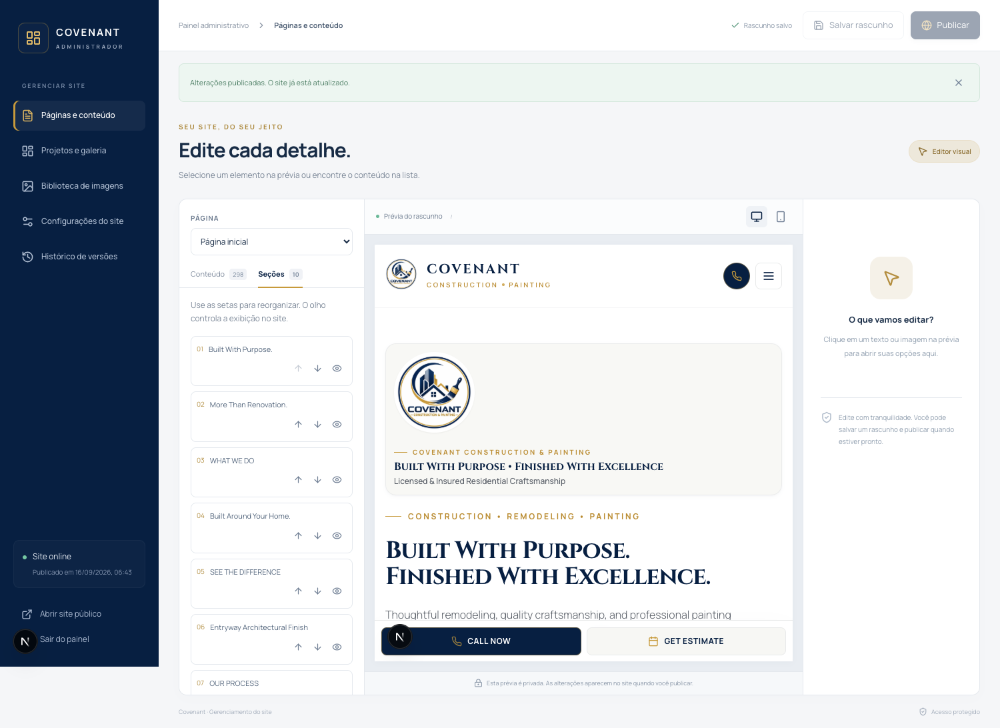

# Covenant Construction & Painting

Institutional website for **Covenant Construction & Painting**, specializing in high-end kitchen remodeling, bathroom renovations, residential painting, and architectural home improvements.

## Prévia do painel administrativo

O cliente pode visualizar abaixo a interface do painel. Esta imagem foi capturada durante a validação; o painel interativo precisa do site executando em uma hospedagem com Node.js.



Localmente, acesse [http://localhost:3001/admin](http://localhost:3001/admin) enquanto o servidor estiver iniciado. O endereço local funciona no computador que executa o projeto. As orientações de hospedagem e de primeiro acesso estão na seção **Painel administrativo**, abaixo.

## 🏗️ Tech Stack

- **Framework:** [Next.js 15 (App Router)](https://nextjs.org/)
- **Language:** [TypeScript](https://www.typescriptlang.org/)
- **Styling:** [Tailwind CSS](https://tailwindcss.com/)
- **Icons:** [Lucide React](https://lucide.dev/)
- **Animations:** [Framer Motion](https://www.framer.com/motion/)

## 🎨 Brand Identity & Design System

- **Primary Colors:**
  - Deep Navy: `#071F41`
  - Secondary Navy: `#102F58`
  - Sophisticated Gold: `#C79A3B`
  - Pure White: `#FFFFFF`
  - Warm Off-White: `#F7F7F4`
- **Typography:**
  - Headings: *Cinzel* (Google Fonts)
  - Body: *Manrope* (Google Fonts)
- **Design Concept:** Editorial Architecture & Exaggerated Minimalism

## 📄 Site Architecture

1. `/` — Home (Hero, Standards, Services, Feature Project, Interactive Before/After, Process Timeline, Why Us, Gallery, Final CTA)
2. `/about` — About Us (Brand Pillars, Craftsmanship & Approach)
3. `/services` — Services Overview
4. `/services/kitchen-remodeling` — Dedicated Kitchen Page
5. `/services/bathroom-remodeling` — Dedicated Bathroom Page (featuring interactive Before & After slider)
6. `/services/painting` — Professional Interior & Exterior Painting
7. `/projects` — Projects & Gallery with Category Filters
8. `/before-after` — Before & After Hub with Interactive Sliders
9. `/contact` — Contact & Estimate Inquiries (Direct phone: `508-405-6918`)

## 🚀 Getting Started

```bash
# Install dependencies
npm install

# Run development server
npm run dev

# Build for production
npm run build
```

## 📞 Direct Contact

- **Phone:** 508-405-6918
- **Email:** damascenoluiz31@gmail.com

## Painel administrativo

Acesse `/admin`. No primeiro acesso local, crie uma senha de pelo menos 12 caracteres. Depois, use essa senha para entrar. Não há senha padrão. A senha é armazenada como hash scrypt; a sessão usa um cookie HttpOnly com validade de 8 horas. O painel e as APIs administrativas exigem autenticação.

O painel permite:

- Editar textos, imagens, descrições das imagens, links de botões e campos dos formulários nas nove páginas existentes, incluindo cabeçalho e rodapé.
- Selecionar o conteúdo diretamente na prévia ou pela lista de campos. Para conteúdo dentro de menus, galerias e modais, abra o elemento na prévia usando as áreas sem texto ou os controles com ícones.
- Reordenar e ocultar seções. As seções ocultas ficam esmaecidas na prévia para continuar acessíveis à edição.
- Adicionar seções com título, texto, imagem opcional, botão e fundo claro ou escuro.
- Adicionar, editar, excluir e ordenar projetos da galeria, incluindo categoria, destaques e imagens de antes/depois.
- Enviar fotos JPG, PNG, WebP e GIF de até 10 MB ou escolher as imagens existentes. A troca de uma imagem compartilhada se aplica aos locais que usam o mesmo arquivo.
- Alterar telefone, e-mail, nome da empresa, cores principais, título e descrição para buscadores.
- Salvar rascunhos sem alterar o site público e publicar após revisar a prévia. As últimas 15 versões anteriores são preservadas; recuperar uma versão altera apenas o rascunho até uma nova publicação.

As alterações não salvas permanecem somente na aba aberta. O painel avisa ao sair com alterações pendentes e rejeita salvamentos quando outra aba já atualizou o conteúdo.

### Armazenamento e hospedagem

Por padrão, `storage/content.json` contém o rascunho, a publicação e o histórico; `storage/admin.json` contém as credenciais; `storage/uploads/` contém as imagens enviadas. Essa pasta é privada e ignorada pelo Git. As imagens são entregues por `/api/media/[filename]`. As edições publicadas são renderizadas também no HTML inicial, incluindo os metadados globais e os contatos do JSON-LD.

A implementação atual requer **um servidor Node.js com uma única instância e disco persistente**. Configure `CMS_DATA_DIR` para um diretório permanente e faça backup de toda a pasta, incluindo as imagens e as credenciais. O disco temporário de funções serverless, como na Vercel, exige substituir essa camada por banco de dados e armazenamento de objetos antes da implantação. O painel não está conectado a um serviço externo.

Para configurar o primeiro acesso em produção, defina `ADMIN_SETUP_TOKEN` como um segredo aleatório no ambiente do servidor. O formulário inicial exigirá esse token junto com a nova senha. O primeiro acesso sem token é permitido somente em desenvolvimento no endereço localhost. Use HTTPS em produção, pois o cookie de sessão é Secure.

O editor mantém os componentes e as interações existentes. Novas seções usam o modelo descrito acima; criar rotas novas, alterar estruturas de layout específicas e adicionar novas funcionalidades ainda exige desenvolvimento. Os formulários de orçamento preparam uma mensagem para o visitante enviar pelo aplicativo de SMS ou e-mail, conforme descrito abaixo.

### Validação do CMS

```bash
# No macOS, os testes usam o Google Chrome instalado.
# Em outros sistemas, instale o Chromium do Playwright primeiro:
npx playwright install chromium
npm run test:cms
npx tsc --noEmit
npm run build
```

O teste usa um servidor separado na porta 3100, uma pasta de build própria e armazenamento temporário. Verifica autenticação, isolamento do rascunho, publicação, edição de imagens, upload, seções, recuperação de versões, contatos e metadados. Não cria senha nem publica conteúdo no projeto local principal.

### Hostinger (hospedagem escolhida)

O projeto precisa de Next.js executado como aplicação Node.js, incluindo as APIs do painel. A Hostinger oferece esse tipo de aplicação nos planos Business e Cloud; VPS também permite executar Node.js, com configuração própria. Consulte o [guia oficial da Hostinger](https://www.hostinger.com/support/how-to-deploy-a-nodejs-website-in-hostinger/).

Configuração básica da aplicação, quando o plano oferecer Node.js:

- Framework: Next.js com backend (não exportação estática).
- Instalação: `npm ci`.
- Build: `npm run build`.
- Inicialização, quando houver esse campo: `npm run start`.
- Saída do build: `.next`.
- Ambiente: `NODE_ENV=production` e `ADMIN_SETUP_TOKEN` com um segredo gerado no servidor.

O plano exato ainda precisa ser informado para concluir a persistência. A documentação de implantação consultada não confirma que os arquivos escritos pela aplicação sobrevivem a uma nova implantação; portanto, não considere a pasta `storage/` dentro da aplicação como armazenamento permanente sem verificar isso na conta.

Em um VPS com uma única instância, configure `CMS_DATA_DIR` apontando para uma pasta permanente fora das pastas de implantação, com permissão de leitura e escrita para o usuário do processo Node.js. Essa pasta deve ser mantida durante as atualizações e incluída nos backups.

Nos planos gerenciados, confirme se existe uma pasta gravável e preservada entre implantações. Caso não exista, a camada atual de arquivos deve ser adaptada para banco de dados e armazenamento permanente de imagens antes de colocar o painel em produção. A Hostinger documenta a [conexão de MySQL a aplicações Node.js](https://www.hostinger.com/support/connecting-a-hostinger-mysql-database-to-a-node-js-application/); a configuração depende da conta e do plano.

Nenhuma implantação ou conexão à conta Hostinger foi realizada.


## Solicitações de orçamento pelo celular do cliente

A página `/contact` e o componente `EstimateModal` montam uma mensagem com nome, telefone, e-mail, tipo de projeto e descrição. Ao continuar, o site apresenta o texto e links para abrir o aplicativo de mensagens com o destinatário **+15084056918** e o texto preenchido. O cliente precisa revisar e tocar em **Enviar** no aplicativo. O site não confirma o envio nem a entrega.

Não é necessário configurar Twilio para esse fluxo. O formulário não chama `/api/estimates` e não arquiva os dados no servidor. Os dados permanecem na aba para editar ou copiar. Também há um link `mailto:` para **damascenoluiz31@gmail.com**, com assunto e corpo preenchidos.

O suporte à abertura e ao preenchimento depende do celular e do aplicativo. O link usa `?body=` normalmente e a variante `&body=` para iPhone/iPad. A página mantém o texto disponível para copiar quando o aplicativo não preencher a mensagem ou não estiver instalado, inclusive no computador. É necessário validar a abertura em aparelhos Android e iPhone reais; os testes no Chrome verificam os links e os dados, não o envio pelo celular.

A integração anterior com Twilio permanece disponível no código da API, mas não é utilizada pelos formulários. Suas variáveis de ambiente podem ficar vazias.

```bash
npm run test:estimates
```

Os testes verificam os links, caracteres especiais, todos os dados preenchidos, edição e ausência de chamadas à API pelo formulário. Também mantêm a validação isolada da API anterior sem enviar SMS real.
